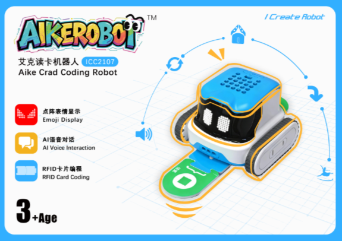

# Introduction
##  Design Concept  
The Aike RFID Card-Reading Robot is a screen-free STEAM programming educational tool designed for children aged 3 and above. Based on RFID technology, the robot uses physical instruction cards to read, memorize, and execute commands, allowing children to experience programming logic in an intuitive and engaging way. It also supports intelligent voice interaction to enhance the human-robot interaction experience.

The product is suitable for use in kindergartens, early education institutions, and parent-child activities at home. It is recommended for use on flat, dry indoor surfaces, such as tabletops or floors.

<!-- 这是一张图片，ocr 内容为： -->

##  Package Contents  
| Name | Quantity |
| :---: | :---: |
|  AIKE Robot   | 1 |
|  RFID Card Accessory Box   | 2 |
|  Gripper Accessory Box   | 1 |
|  Line-Following Map   | 1 |
|  User Manual   | 1 |

##  Gripper Accessory Box Contents  
| Name | Quantity |
| :---: | :---: |
|  Gripper   | 1 |
|  Friction Pin   | 5 |
|   USB Cable（A/C）  | 1 |
|  Grove Connection Cable   | 1 |

##  RFID Card Accessory Box Contents  
### RFID Card Accessory Box  01 （ 25 Cards in Total ）
| Name | Quantity |
| :---: | :---: |
|  | 4 |
|  | 3 |
|  | 3 |
|  | 3 |
|  | 2 |
|  | 2 |
|  | 1 |
|  | 1 |
|  | 1 |
|  | 1 |
|  | 1 |
|  | 1 |
|  | 1 |
|  | 1 |

### RFID Card Accessory Box 02  （ 26 Cards in Total ）
| Name | Quantity |
| :---: | :---: |
|  | 3 |
|  | 2 |
|  | 2 |
|  | 2 |
|  | 1 |
|  | 1 |
|  | 1 |
|  | 1 |
|  | 1 |
|  | 1 |
|  | 1 |
|  | 1 |
|  | 1 |
|  | 1 |
|  | 1 |
|  | 1 |
|  | 1 |
|  | 1 |
|  | 1 |
|  | 1 |
|  | 1 |

