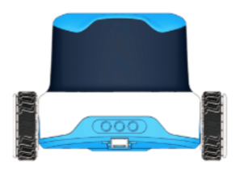
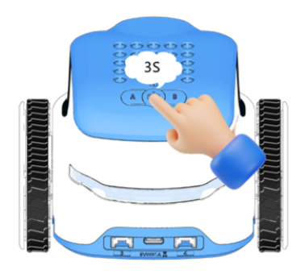
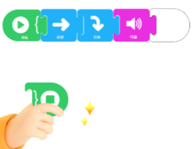
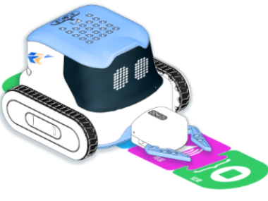
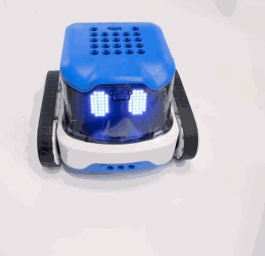
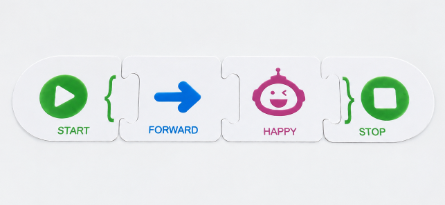
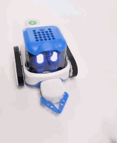
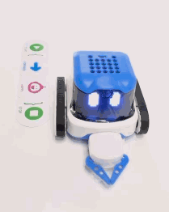

# Quick Start
When using the Aike robot, place an RFID instruction card in the recognition area on the bottom of the robot to read the card and execute the corresponding command.

This article introduces the basic operation of the Aike robot and is intended for users who want to quickly learn the product's basic functions.

##  Preparation  
|  |  |
| :---: | :---: |
| Aike  | RFID card  |

##  How to Use Aike?  
|  |  |
| --- | --- |
| 1. Press and hold the Power button for 3 seconds to power on the robot. The robot announces:“ **Hi, I’m Aike ! I’m ready to learn and have fun with you!** ” | 2. Place the RFID card horizontally. |
|  |  |
| 3. Align the RFID card with the recognition area indicated by the label on the bottom of the Aike robot.  The robot will read the card and execute the corresponding command. |  |

##  How to Quickly Interact with Aike?  
|  |   |
| --- | --- |
| 1.  Press and hold the Power button for 3 seconds to power on the robot.   | 2. Place a single RFID card horizontally. **Applicable Cards:** Action Cards (blue), Sound, Dance, and Expression Cards (purple). **Example:** Forward |
|  |  |
| 3. Align the RFID card with the recognition area indicated by the label on the  bottom of the Aike robot to read the card and execute the corresponding command. |  |

##  How to Read and Execute a Complete Program?  
|  |  |
| --- | --- |
| 1. Press and hold the Power button for 3 seconds to power on the robot.   | 2. Place multiple RFID cards horizontally and arrange them in sequence to form a logically complete program. **Example:**    Start  →  Forward   →  Happy   → Stop |
|  |  |
| 3.  Align the recognition area indicated by the label on the bottom of the Aike robot with the RFID cards to read the program content.   | 4.  After the robot finishes reading the complete program, press the Power button once to execute the program.   |

