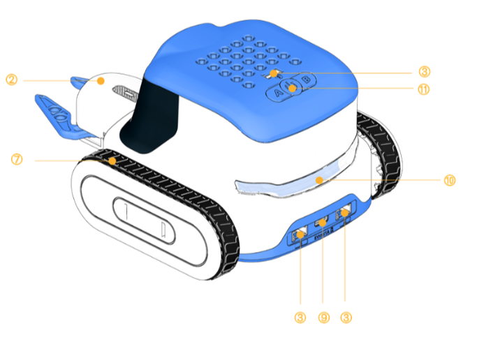
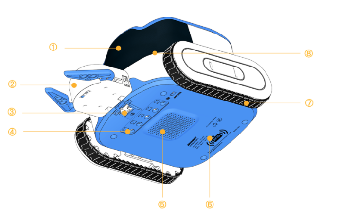

# Aike RFID Card-Reading Robot
##  Structure 

| No. | Name | Description |
| :---: | :---: | --- |
| ① | Dot-Matrix Display | Displays graphical information such as expressions and status indicators. |
| ② | Gripper | Performs actions such as object gripping and handling. |
| ③ |  Grove Interface | Connects compatible sensors and expansion modules using Grove-compatible cables.  |
| ④ | 5-Channel Color and Grayscale Sensor | Detects ground color and grayscale values for line following and color recognition. |
| ⑤ | Speaker | Plays voice prompts, notification sounds, and sound effects. |
| ⑥ | RFID Card Recognition Area | Reads RFID instruction cards for command recognition and program control. |
| ⑦ | Crawler Wheels | Drive the robot forward, backward, and for turning. |
| ⑧ | Microphone | Captures voice and ambient sounds for voice interaction. |
| ⑨ | USB-C Port | Used for device charging, data transmission, and program updates. |
| ⑩ | Programmable Taillights | Control the light color and display effects through programming. |
| ⑪ | Button Area (A Button / Power Button / B Button) | Used for powering the device on/off, switching modes, adjusting the volume, and executing code. |

##  Specifications  
| Parameter | Details |
| :---: | :---: |
| Product Name | Aike RFID Card-Reading Robot |
| Model | ICC2107   |
| Main Controller Chip | ESP32-S3   |
| Product Materials | ABS + PC, electronic components |
| Battery Capacity | 2000mAh   |
| Structural Compatibility | Compatible with mainstream building-block structures for modular creative construction. |

