# RFID Card Reading
During RFID card reading, Aike reads each card and executes the corresponding command based on the card content.

For details about the card content, refer to the [RFID Card Guide](https://aike-robot.readthedocs.io/en/latest/docs/AIKE/07RFIDCardGuide.html). The actions and effects performed by the machine vary depending on the individual card or group of instruction cards being read. The usage logic also differs between card types. Please read this document carefully for detailed information.

##  Direct Reading Mode  
 **Logic Description:**

+ When Aike reads **Action Cards (Blue)**, **Sound, Dance, and Expression Cards (Purple)**, or **Function Cards (Black)**, it directly executes the corresponding commands based on the card content.

|  Read Content   |  Effect Description   |  Description   |
| :---: | --- | --- |
| 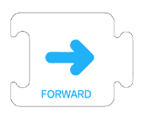 | The tail light turns blue. The machine announces **“Forward,  Going Ahead .”** The corresponding icon is displayed on the screen, and the machine moves forward one step (**14 cm**). |  |
|  | The tail light turns blue. The machine announces **“Backward, going back.”** The corresponding icon is displayed on the screen, and the machine moves backward one step (**14 cm**). |  |
|  | The tail light turns blue. The machine announces **“Right, turning right.”** The corresponding icon is displayed on the screen, and the machine turns right **90°**. |  |
| 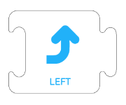 | The tail light turns blue. The machine announces **“Left, turning left.”** The corresponding icon is displayed on the screen, and the machine turns left **90°**. |  |
| 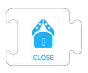 | The tail light turns blue. The machine announces **“ Claw  Close.”** The corresponding icon is displayed on the screen, and the robotic arm closes. | When a card is read without the robotic arm physically connected to the machine, the machine will announce: **“Close the robotic arm. The robotic arm is not connected. Please connect the robotic arm before executing the program.”** In **Programming Mode**, if the program contains a robotic arm command but the robotic arm is not connected, the machine will announce: **“The robotic arm is not connected. Please connect the robotic arm before executing the program.”** The program will not be executed. |
|  | The tail light turns blue. The machine announces **“ Claw  Open.”** The corresponding icon is displayed on the screen, and the robotic arm opens. | When a card is read without the robotic arm physically connected to the machine, the machine will announce: **“Open the robotic arm. The robotic arm is not connected. Please connect the robotic arm before executing the program.”** In **Programming Mode**, if the program contains an open robotic arm command but the robotic arm is not connected, the machine will announce: **“The robotic arm is not connected. Please connect the robotic arm before executing the program.”** The program will not be executed. |
| 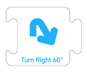 | The tail light turns blue. The machine announces **“Turn right 60°.”** The corresponding icon is displayed on the screen, and the machine turns right **60°**. |  |
|  | The tail light turns blue. The machine announces **“Turn right 30°.”** The corresponding icon is displayed on the screen, and the machine turns right **30°**. |  |
|  | The tail light turns blue. The machine announces **“Turn left 60°.”** The corresponding icon is displayed on the screen, and the machine turns left **60°**. |  |
|  | The tail light turns blue. The machine announces **“Turn left 30°.”** The corresponding icon is displayed on the screen, and the machine turns left **30°**. |  |
| 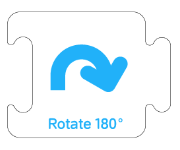 | The tail light turns blue. The machine announces **“Rotate 180°.”** The corresponding icon is displayed on the screen, and the machine turns right **180°**. |  |
|  | The tail light turns blue. The machine announces **“Automatic Line Following.”** The corresponding icon is displayed on the screen, and the machine follows the line until an all-black area is detected, then stops. |  |
| 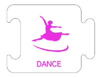 | The tail light turns **purple**. The machine announces **“Dance.”** The corresponding icon is displayed on the screen, and the machine performs a dance. |  |
| 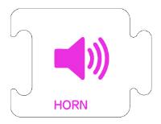 | The tail light turns **purple**. The machine announces **“Horn.”** The corresponding icon is displayed on the screen, and the machine sounds the horn. |  |
| 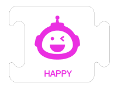 | The tail light turns **yellow**. The machine announces **“Happy.”** The corresponding icon is displayed on the screen. |  |
|  | The tail light turns **light green**. The machine announces **“Calm.”** The corresponding icon is displayed on the screen. |  |
|  | The tail light turns **light blue**. The machine announces **“Sad.”** The corresponding icon is displayed on the screen. |  |
|  | The tail light turns **red**. The machine announces **“Angry.”** The corresponding icon is displayed on the screen. |  |
|  | The tail light turns **gray**. The machine announces **“Scared.”** The corresponding icon is displayed on the screen. |  |
|  | The tail light turns **pink**. The machine announces **“Love.”** The corresponding icon is displayed on the screen. |  |
| 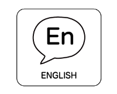 | The machine announces **“Let's talk in English. ”** The corresponding icon is displayed on the screen, and the machine continues to provide voice prompts in English. |  |
| 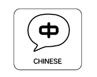 | The machine announces **“ 开始使用中文 ”** The corresponding icon is displayed on the screen, and the machine continues to provide voice prompts in Chinese. |  |
| 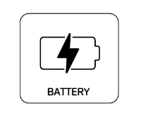 | The machine announces **“  Let's check the battery . ”** The current battery level percentage is displayed on the screen.  |  |
|  | The machine announces **“Start reading Function 1.”** The corresponding icon is displayed on the screen, and the machine moves forward to read the next card. | If no card is detected after the machine moves forward, it announces **“Incomplete Code.”** The corresponding icon is displayed on the screen, and the machine moves from side to side. |
| 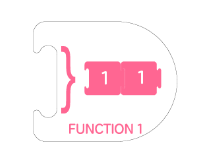 | The machine announces **“Function 1 reading complete.”** The corresponding icon is displayed on the screen. |  |
| 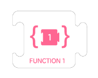 | The machine announces **“Start reading Function 2.”** The corresponding icon is displayed on the screen, and the machine moves forward to read the next card. | If no card is detected after the machine moves forward, it announces **“Incomplete Code.”** The corresponding icon is displayed on the screen, and the machine moves from side to side. |
| 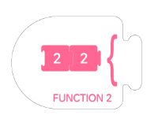 | The machine announces **“Function 2 reading complete.”** The corresponding icon is displayed on the screen. |  |
| 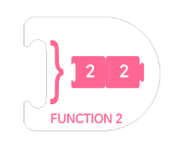 | The machine announces **“Function 1, XX [command content].”** The machine then executes the specified command. | If there is no program in **Function 1**, the machine announces **“Function 1.”** The corresponding icon is displayed on the screen. |
|  | The machine announces **“Function 2, XX [command content].”** The machine then executes the specified command.`  | If there is no program in **Function 2**, the machine announces **“Function 2.”** The corresponding icon is displayed on the screen. |

##  Programming Mode  
###  Function Programming  
**Logic Description:**

+ **Function Start (1 or 2)** → **Another Function (Blue / Purple / Orange / Pink Card)** → **Function End (1 or 2)**

|  Read Content   |  Effect Description   |  Description   |
| :---: | --- | --- |
| 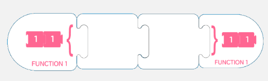 | The machine announces: **“Start reading Function 1, XX, XX, Function 1 reading complete.”** The machine moves forward one step while announcing each card, and the corresponding icon is displayed on the screen. | + The programmed **Function 1** or **Function 2** must be placed within a loop or program to be executed.  + After the function content has been fully read, **Function 1** or **Function 2** can be executed directly. For details, refer to **Direct Reading Mode**. |

###  Program Programming  
**Logic Description:**

+ **Start** → **Function 1 and Function 2 (Blue / Purple / Orange / Pink Cards)** → **End**

|  Read Content   |  Effect Description   |  Description   |
| :---: | --- | --- |
| 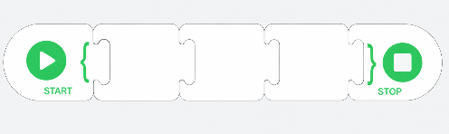 | The machine announces: **“ Let’s get started!  XXXX reading complete.”** The machine moves forward one step while announcing each card, and the corresponding icon is displayed on the screen. | + **Place the “Start” card first:** The robot begins recording the program only after recognizing the **“Start”** card.  + **Read the instruction cards in order:** The robot reads and stores your instructions one by one.  + **Place the “End” card last:** After recognizing the **“End”** card, the robot completes program recording.  + **Incomplete Code:** If no card is detected after the **“Start”** card, the robot announces **“Incomplete Code.”** The corresponding icon is displayed on the screen, and the robot moves from side to side.  + **Execute the program:** After the program has been recorded, press the middle button to execute it.  + **Note:** Make sure the cards are placed in the correct order. Otherwise, the program may be recorded incorrectly. |

###  Loop Programming  
**Logic Description:**

+ **Loop Start** → **Function 1 and Function 2 (Blue / Purple / Orange / Pink Cards)** → **Loop N×（Loop 2× 、Loop 3×、Loop 4×）**

|  Read Content   |  Effect Description   |  Description   |
| :---: | --- | --- |
| 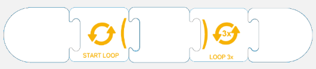 | The machine announces: **“XXXX, loop, XXXX,  loop twice（or loop  three times  or  four times ）,XXXX.”** The machine moves forward one step while announcing each card, and the corresponding icon is displayed on the screen. | + Loop programming content must be placed within **Function Programming** or **Program Programming** to be executed.  + **Blue, Purple, Pink (Function 1 and Function 2), and Orange Cards** can be placed between the Loop Start and Loop End cards.  + Placing an **Orange Card** inside another loop enables **nested loops**. |

