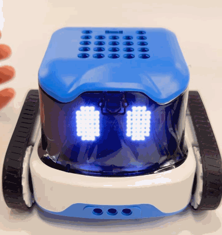
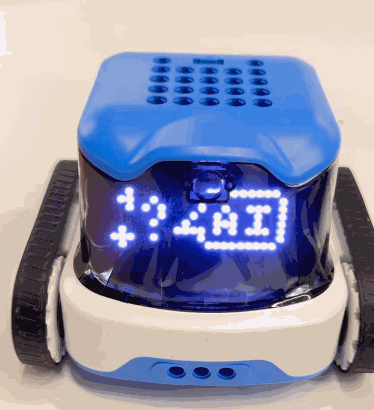
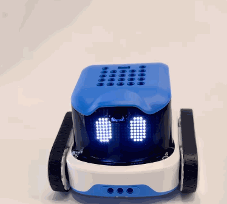

# Mode Switching
##  RFID Card Reading → Xiaozhi AI  
### Operating Procedure
1. When the machine is powered on, press and hold the **B** button for 3 seconds. The machine will announce: **“Entering mode switching. Press the middle button to switch to Xiaozhi AI mode. Press any other button to exit.”**
2. When the machine switches to the **AI** interface, press the **Power** button.
3. The machine enters **Xiaozhi AI Mode** and announces: **“Entering network configuration mode.”**

**Note:**

+ If the machine has already been configured with a network and can connect successfully, it will not announce **“Entering network configuration mode”** and will directly enter the interactive standby state.
+ During **Step 2**, if a button other than the **Power** button is pressed, the machine will remain in **RFID Card Reading Mode**.

###  Operation Demonstration  
|  |  |
| --- | --- |
| **Step 1:** Power on the device. | **Step 2:** Press and hold the **B** button for 3 seconds. |
|  |  |
| **Step 3:** Press the middle button. If the device announces **“Please connect to a network”** and the display shows the eye status, the mode switch is successful. |  |

## Xiaozhi AI → RFID Card Reading
### Operating Procedure
1. When the device is powered on, use the **A** and **B** buttons to switch to the **Code** interface.
2. Press the **Power** button.

###  Operation Demonstration  
|  |  |
| --- | --- |
| **Step 1: **Power on the machine with the **Xiaozhi Version** firmware installed. | **Step 2: Use the A and B buttons to switch to the Code interface and select it.** |
|  |  |
| **Step 3: **The display will show the switching progress. When the machine announces **“ Hi, I’m Aike ! I’m ready to learn and have fun with you!  ”**, the switch is complete. | |

