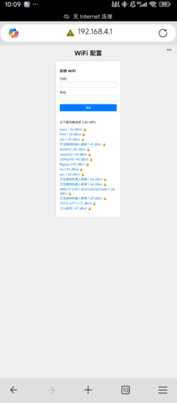
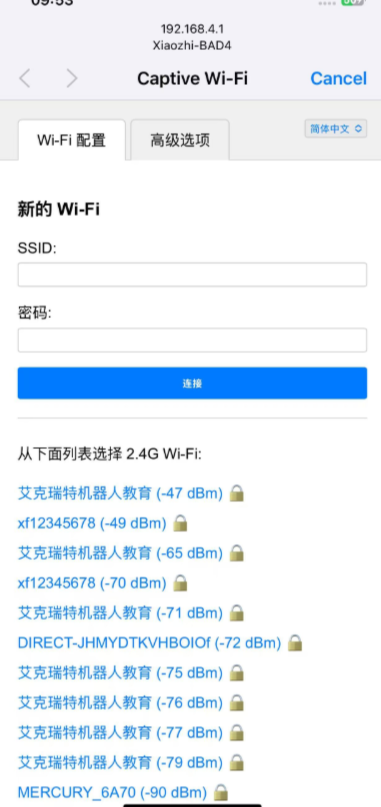
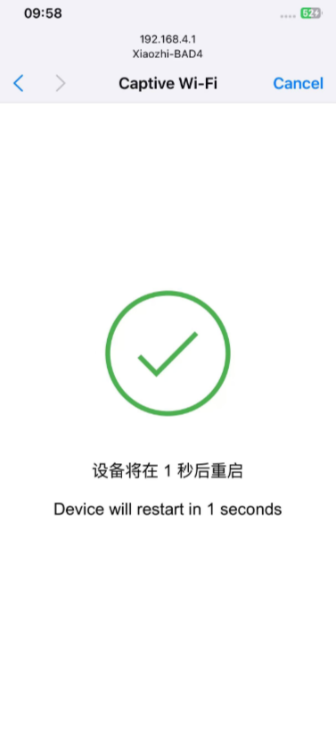
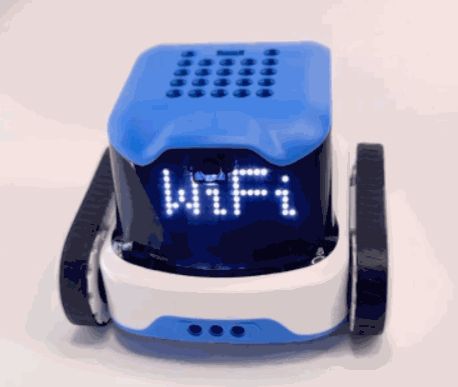
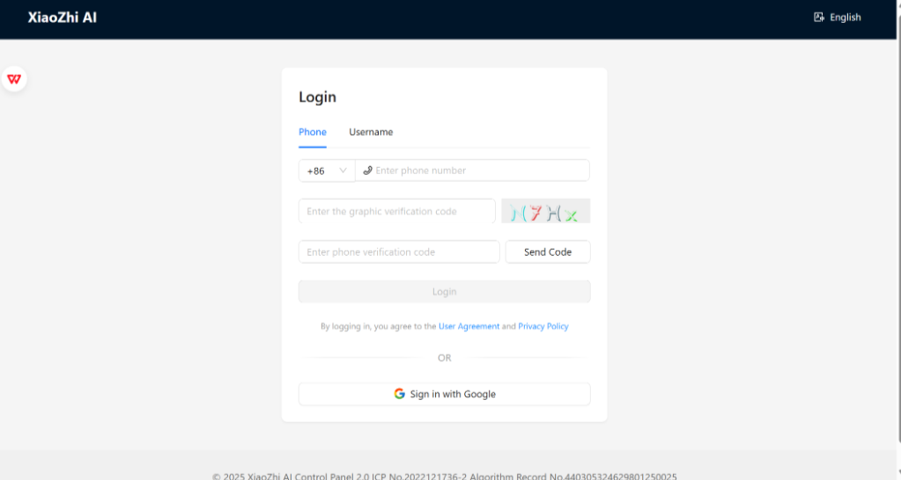
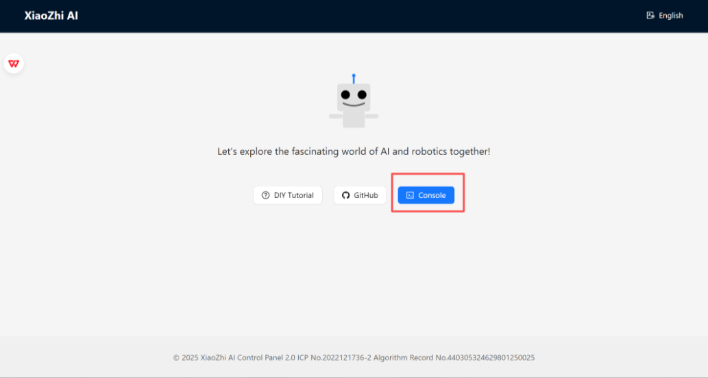
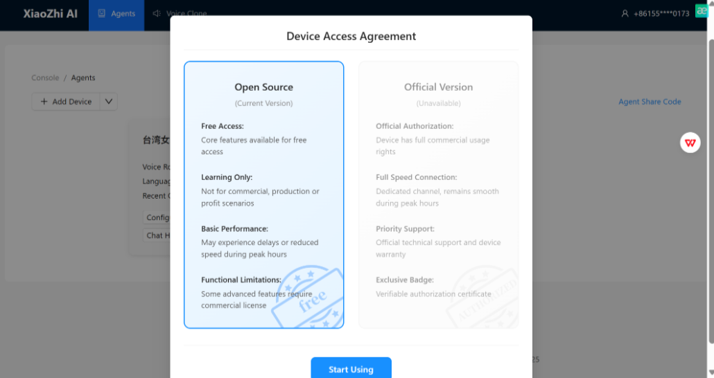
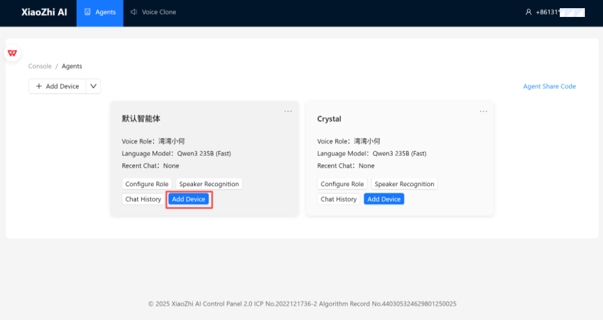
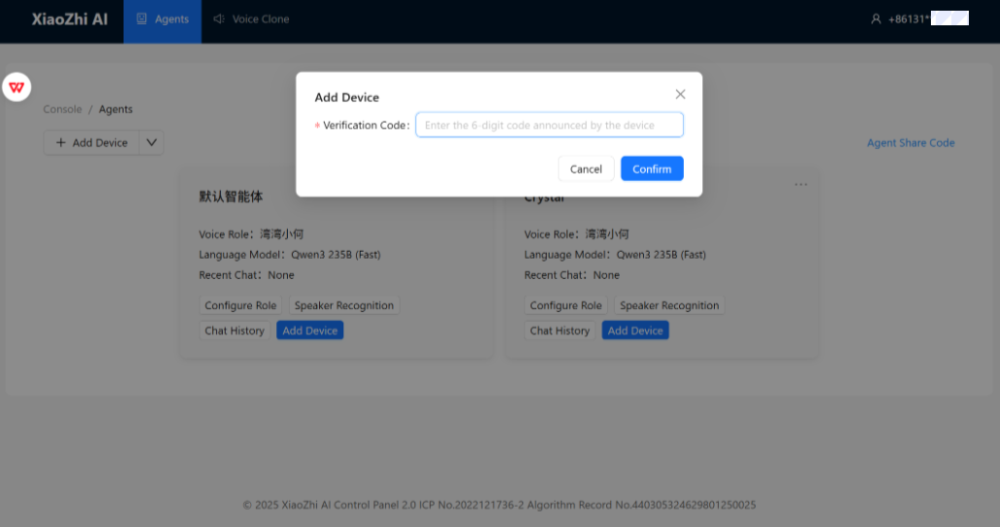
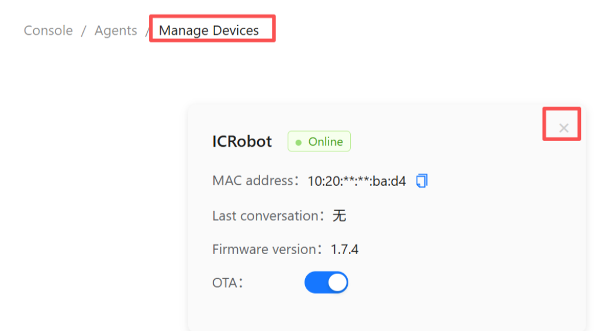

# Xiaozhi AI Setup Guide
## Instructions
Step 1. Switch the ICRobot internal firmware to Xiaozhi AI, the method can refer to[Mode Switching](https://aike-robot.readthedocs.io/en/latest/docs/AIKE/05ModeSwitching.html)

Step 2. Connect ICRobot to configure the network operation, details can refer to the contents of this document.

## Connect & Configure Wi-Fi
**Important: Read Before Operation!!!**

When using the backend for the first time, you must register and log in using a mobile phone number. **Otherwise, you will not be able to access the backend.**

**Recommendation:**

**Step 1:** Complete the backend registration first. After adding the console, remain on the verification code entry screen. For detailed instructions, refer to the **Backend Registration** section below.

**Step 2:** Power on the device. After startup, the device will prompt **“Entering network configuration mode.”**

**Step 3:** Configure the network connection for the robot and wait for the robot to announce the verification code. For detailed instructions, refer to the **Network Configuration** section below.

**Step 4:** Enter the announced verification code in the backend to establish the device connection.

_Note: If the device has already been configured with a network connection, but you want to clear the current network configuration and connect to another network, power on the device in __**Xiaozhi Mode**__, use the  __🅰️__ __🅱️__ buttons to switch to the __**Wi-Fi**__ interface, and then press the Power button to reset the network configuration. For detailed instructions, refer to the __**Reset Network**__ section below._

### **Network Configuration**
### Configure Network
|  |  |
| --- | --- |
| 1. On your mobile device, go to Settings > Wi-Fi. | 2. Select the network XiaoZhi-XXXX, where XXXX represents the last 4 digits of the MAC address. |
|  |  |
| 3. After completing Operation 2, the mobile phone will automatically navigate to the network configuration page. **If the page does not open automatically, refer to Operation 4.** | 4. If your phone does not auto-redirect, open a browser and manually enter:[http://192.168.4.1](http://192.168.4.1) This will take you to the same configuration page. |
|  |  |
| 5.  + Select an available Wi-Fi network (SSID) from the blue area below, then enter the Wi-Fi password. + You can also manually enter the Wi-Fi network name (SSID) and password to connect to the network. | 6.  + After clicking Connect, the connection is successful, please wait patiently for the device to reboot. Note:  After the device reboots and turns on, it will broadcast the device code, please make sure to remember the device code broadcasted by the device! |

### Reset Network
|  |  |
| --- | --- |
| 1. Reset Network   | 2. Use the  🅰️ 🅱️ buttons to switch to the screen displaying **“WIFI”**, and select it. |
|  | |
| 3. The machine will announce “Entering network configuration mode”. Then, follow the steps described in *9*Network Configuration** above to connect the machine to a new network. | |

### **Backend Registration** 
|  |  |
| --- | --- |
| 1.  + Open the website link in a browser to access the website. + Register an account by entering your mobile phone number and verification code.  | 2.   Click the following link to access the console:  [https://xiaozhi.me/](https://xiaozhi.me/)    |
|  |  |
| 3. After entering the console, select **Open Source Version**. | 4. Click **Add Device**. |
|  |  |
| 5. Enter the device code announced by the device after network configuration is completed, then click **Confirm**.   If you did not note down the device code, power off the device and power it on again. The device code will be announced during startup. | 6. When this interface is displayed, the Xiaozhi configuration is complete. After configuration, you can power on the device directly for subsequent use without repeating the configuration process.   _This applies only if the Xiaozhi firmware remains installed and has not been replaced with the standard firmware._ **Note:** If the device is already bound to a user account and you want to bind it to a different account, first delete the device from the currently bound user account. |

