# RFID Card Guide
## Action
|  | 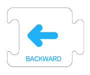 | 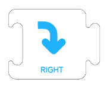 |  |
| :---: | :---: | :---: | :---: |
|  Move Forward One Step（14CM） |  Move Backward One Step（14CM） |   Turn Right 90° |   Turn Left 90° |
|  | 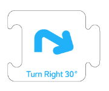 | 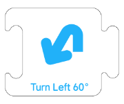 | 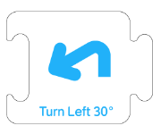 |
|  Turn Right 60° |  Turn Right 30° | Turn Left 60° | Turn Left 30° |
|  | 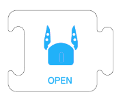 |  | 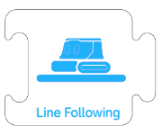 |
|  Rotate 180° |  Open the Gripper |  Close the Gripper | Start Line Following  (Continue line following until  a completely black area is detected) |

## Control
| 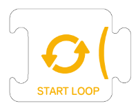 | 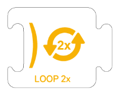 | 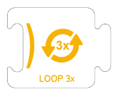 | 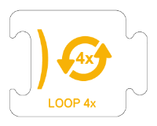 |
| :---: | :---: | :---: | :---: |
|  Start Loop | Loop 2 Times (Loop End, 2 Times) | Loop 3 Times (Loop End, 3 Times) | Loop 4 Times (Loop End, 4 Times) |
|  | 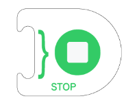 |  |  |
|  Start Programming   |  End Programming |  |  |

## Expressions & Action
|  |  |  |  |
| :---: | :---: | :---: | :---: |
| Dance&nbsp;&nbsp;&nbsp;&nbsp;&nbsp;&nbsp;&nbsp;&nbsp;&nbsp;&nbsp;&nbsp;&nbsp; | Horn |  Happy Expression   | Calm Expression |
|  |  |  |  |
| Sad Expression | Angry Expression | Scared Expression | Love Expression |

## Functional
|  |  |  |
| :---: | :---: | :---: |
| **Battery Level**  (Displays the current battery level) | **Chinese**  (Switches the voice language to Chinese) | **English**  (Switches the voice language to English) |

## Function
| 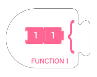 |  |  |
| :---: | :---: | :---: |
| **Start Function 1** (Starts reading Function 1) | **End Function 1**  (Ends reading Function 1) | **Function 1**  (Executes Function 1) |
|  |  | 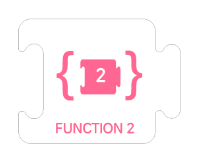 |
| **Start Function 2**  (Starts reading Function 2） | **End Function 2**  (Ends reading Function 2) | **Function 2**  (Executes Function 2) |

